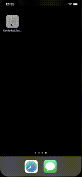

# Kamishibai

[](https://travis-ci.org/ksk.matsuo@gmail.com/Kamishibai)
[](http://cocoapods.org/pods/Kamishibai)
[](http://cocoapods.org/pods/Kamishibai)
[](http://cocoapods.org/pods/Kamishibai)


Kamishibai makes easy to create long tutorial.

## Features



- Manage progress of tutorial
- Support presenting transitioning of UIViewController
- Support push/pop transitioning of NavigationController
- Focus with animation where you want
- Support custom guide view

## Example

To run the example project, clone the repo, and run `pod install` from the Example directory first.

``` swift
// create Kamishibai instance
let kamishibai = Kamishibai(initialViewController: self)

// append first scene and focus CGRect(x: 0, y: 100, width: 50, height: 50)
kamishibai.append(KamishibaiScene(scene: { (scene) in
    guard let vc = scene.kamishibai?.currentViewController as? UIViewController else { return }
    let frame = CGRect(x: 0, y: 100, width: 50, height: 50)
    scene.kamishibai?.focus.on(view: vc.navigationController?.view, focus: Focus.Rect(frame: frame))
    scene.fulfillWhenTapFocus()
}))

// append second scene and add customized view
kamishibai.append(KamishibaiScene(transition: .push(SecondViewController.create()), scene: { (scene) in
    let guide = SampleGuideView.create()
    scene.kamishibai?.focus.addCustomView(view: guide, position: .bottomRight(CGPoint.zero))
    scene.fulfillWhenTap(view: guide.button)
}))

// 
kamishibai.startStory()
```

## Requirements
- iOS 9.0
- Swift 4.0

## Installation

Kamishibai is available through [CocoaPods](http://cocoapods.org). To install
it, simply add the following line to your Podfile:

```ruby
pod "Kamishibai"
```

## Author

ksk.matsuo@gmail.com

## License

Kamishibai is available under the MIT license. See the LICENSE file for more info.
